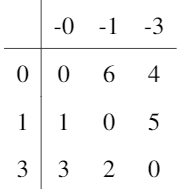
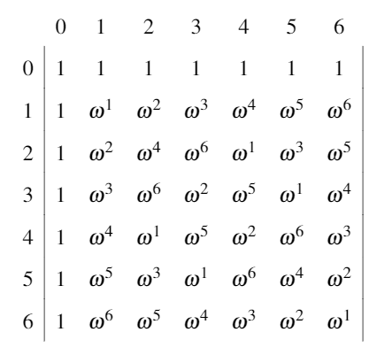
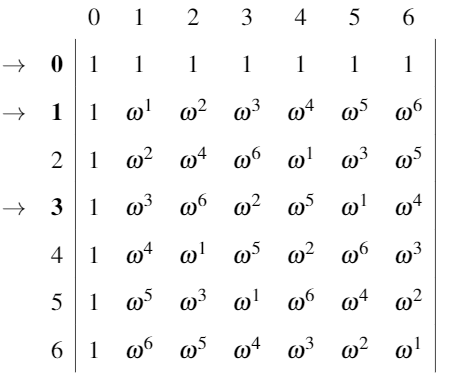
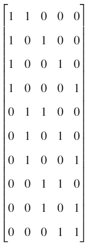
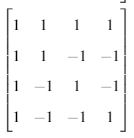
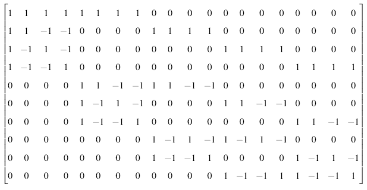

```{r, include = FALSE}
knitr::opts_chunk$set(
  collapse = TRUE,
  comment = "#>"
)
```

```{r setup, echo=FALSE}
library(FRame.BuildR)
```
Welcome to FRame.BuildR.  This package is designed for Frame Theorists interested in compuationally testing new frames.  If you have found yourself here and aren't familiar with the structures of Frames, the following resources can introduce you to the concept.  If you, for some reason, simply desire to get straight to the functions, simply scroll to the bottom of the vignette.

* [Frames](https://en.wikipedia.org/wiki/Frame_(linear_algebra))
* [Groups](https://en.wikipedia.org/wiki/Group_(mathematics))
* [Different Sets](https://en.wikipedia.org/wiki/Difference_set)

As a brief overview of the package, it currently has 4 primary functions:

* build.grp() - Converts a set of integers into a group object.  Currently only works with Cyclic groups based on the integers (Z mod n).

* build.ds() - Converts a vector of integers and a group into a difference set object (Currently has the same restrictions as build.grp).

* frame.ds() - Takes a difference set and associated group and constructs a frame object by extracting the rows associated with the difference set from the character table of the group.

* frame.stein() - Takes an Adjacency Matrix for a Balanced Incomplete Block Design (BIBD) and embeds the
corresponding rows of a Hadamard matrix, creating a new frame.

# Constructing a Frame from a Difference Set
A Difference set D is a set of numbers with an associated group H such that when the differences between elements of D are collected, the non-identity members of H all appear equally.  This can be demonstrated by computing the difference table.  For example, the set {0,1,3} is a difference set for the integers mod 7 ($Z_7$ ={0,1,2,3,4,5,6}).  This means that the entry in column -3 and row 1 has the value 1-3 (mod 7) = 5.  See the difference table below:
```{r, echo = FALSE, out.width = "150px", fig.align='center'}

```

Notice that in the final table, the values of $Z_7$ (excluding 0) all show up once.  That's what makes this a difference set.  Once we have a difference set for a group, we need to construct a Character Table.  First, we can recall that $\omega = e^{\frac{2\pi i n}{N}}$ is a point on the complex unit circle (meaning that $|\omega|^2 = 1$ for all integers $n$ and $N$).  If we define a matrix $X$ such that $X(a,b) = \omega^{a*b}$ and indexed by $Z_7$, this will create 7 orthogonal vectors as the columns of the matrix:

```{r, echo = FALSE, out.width = "300px", fig.align='center'}

```
Next, we can pull out the rows that correspond to the difference set:
```{r, echo = FALSE, out.width = "300px", fig.align='center'}

```
We arrive at the following $3\times 7$ matrix:
```{r, echo = FALSE, out.width = "300px", fig.align='center'}
knitr::include_graphics("images/frametab.PNG")
```
These 7 vectors in Dimension 3 space form an Equiangular Tight Frame for the space.

# Steiner Frame Construction
Another method of constructing frames (That are also Equiangular and Tight) is known as the Steiner construction.  
The Steiner construction begins with a Balanced Incomplete Block Design (BIBD).  A BIBD($v,k,\lambda$) is an experimental design of $v$ factors that groups your runs into $b$ blocks, where the same number of factors are present in each block (the number $k$).  Each factor is present in $r$ blocks and the number of shared blocks between any two factors is $\lambda$.
We can use the adjacency matrix for a BIBD with $\lambda = 1$ to build a frame.  In an adjacency matrix, the columns represent the factors and the rows represent the blocks.  Consider the adjacency matrix for the BIBD(5,2,1):
```{r, echo = FALSE, out.width = "150px", fig.align='center'}

```
Noting that $r=4$ (there are 4 1's in every column), we can construct an $r\times r$ hadamard matrix.  A hadamard matrix is a square matrix whose entries are all complex numbers $z$ with $|z|^2=1$ (note, a character table is a complex hadamard).  If we take the $4\times 4$ hadamard matrix below

```{r, echo = FALSE, out.width = "150px", fig.align='center'}

```

We can use a process known as "embedding" to substitute values in the BIBD with values from the hadamard.  In each column of the BIBD, we can substitute the 1 with the associated row of the hadamard.  So the first 1 in a column becomes the first row of a hadamard, the second 1 becomes the second row, etc.  Then we simply pad the rest of the matrix with zeros:

```{r, echo = FALSE, out.width = "400px", fig.align='center'}

```

Here we took a $10\times 5$ matrix, embedded a $4\times 4$ hadamard and got 20 vectors in 5-space that also represent an Equiangular Tight Frame.

# Using the Package
With the exception of hadamard matrices, all matrices *must* be passed with as.integer.

Difference Set Method:

* Find a difference set for a group (for example, the compliment of the difference set in section 1: $D = \{2,4,5,6\}$ is also a difference set for $Z_7$)
* Build a group object for the group:
```{r, eval = FALSE}
g<-build.group(as.integer(0:6))
```

* Build a difference set object:
```{r, eval = FALSE}
diff.set<-build.ds(as.integer(2,4,5,6))
```

* Pass your difference set object to frame.ds:
```{r, eval = FALSE}
ds.frame<-frame.ds(diff.set)
```

* Access the matrix using the @ symbol:
 ```{r, eval = FALSE}
F<-diff.set@Matrix
```
Steiner Method:

* Only requires a BIBD matrix (must be integer-valued -) and a HADAMARD matrix (can be complex or real).

 ```{r, eval = FALSE}
BIBD<-matrix(as.integer(c(1,1,...)), ncol = v)
HADAMARD<-matrix(c(...)ncol = r)
diff.set<-frame.stein(bibd = BIBD, had = HADAMARD)
```

* Matrix can also be accessed via the @ symbol

 ```{r, eval = FALSE}
F<-diff.set@Matrix
```

For both methods, you can confirm that you have an Equiangular Tight Frame by multiplying the matrix $F$ by its complex adjoint:

 ```{r, eval = FALSE}
F%*%Conj(t(F))
```

Should return a constant multiple of the Identity (up to machine precision).

 ```{r, eval = FALSE}
Mod(Conj(t(F))%*%F)
```
Should be constant down the diagonal (number of rows) an a different constant on the off-diagonals for difference set Frames.  For Steiner Frames, it should be blocks of Identities (times a scalar) and constant in the off-diagonal blocks.
